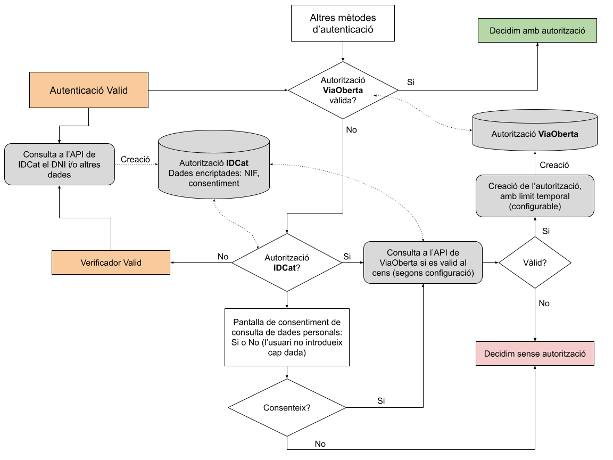
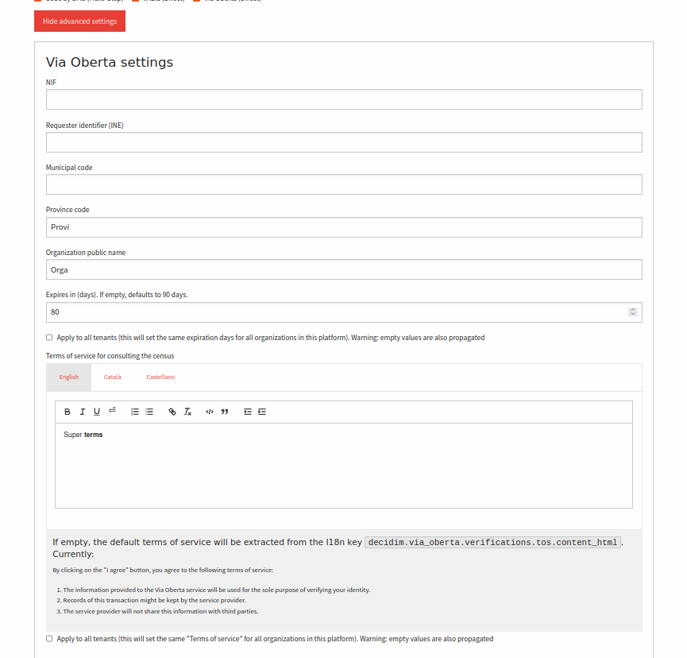
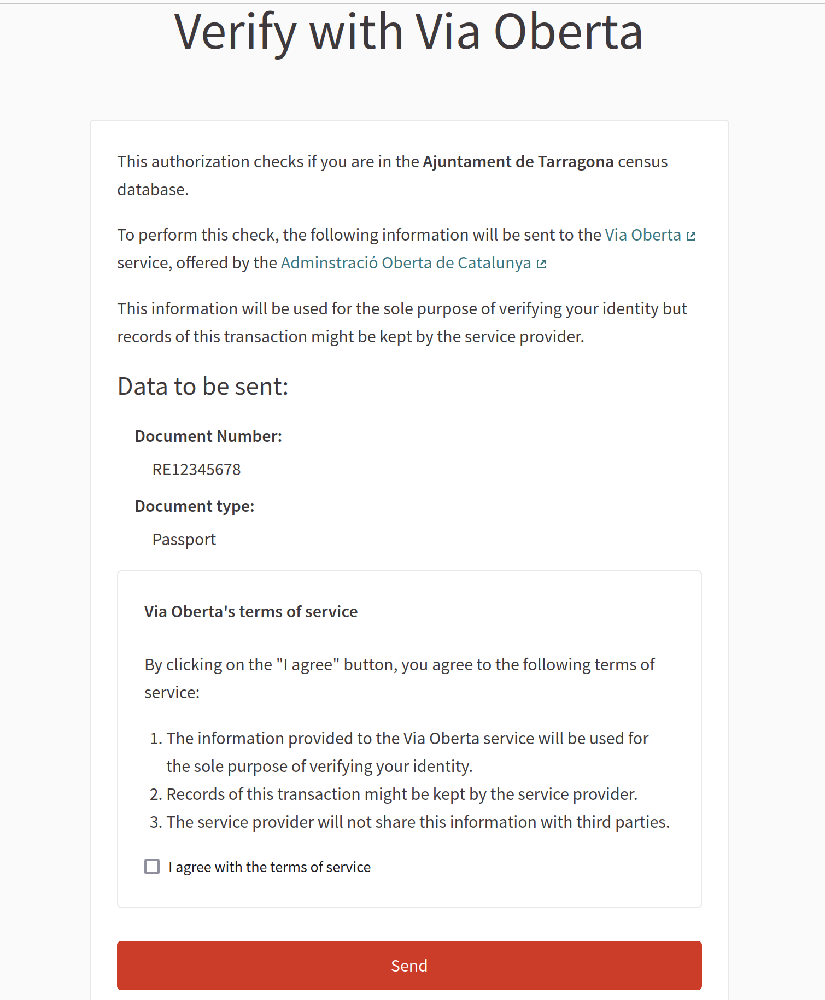
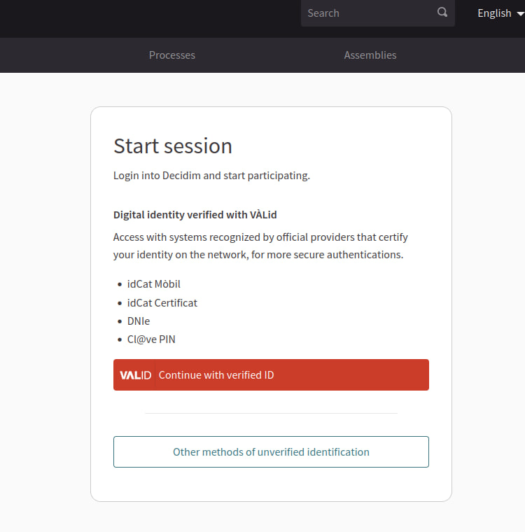

# Decidim :: Trusted IDs

[![[CI] Lint](https://github.com/ConsorciAOC-PRJ/decidim-module-trusted-ids/actions/workflows/lint.yml/badge.svg)](https://github.com/ConsorciAOC-PRJ/decidim-module-trusted-ids/actions/workflows/lint.yml)
[![[CI] Test](https://github.com/ConsorciAOC-PRJ/decidim-module-trusted-ids/actions/workflows/test.yml/badge.svg)](https://github.com/ConsorciAOC-PRJ/decidim-module-trusted-ids/actions/workflows/test.yml)
[](https://codeclimate.com/github/ConsorciAOC-PRJ/decidim-module-trusted-ids/maintainability)
[](https://codecov.io/gh/ConsorciAOC-PRJ/decidim-module-trusted-ids)
[](https://badge.fury.io/rb/decidim-trusted-ids)

Translations:

[](https://crowdin.com/project/decidim-trusted-ids)

This module is an evolution of the original [IdCat Mòbil](https://github.com/gencat/decidim-module-idcat_mobil) that was funded by the Department d'Exteriors of [Generalitat de Catalunya](http://gencat.cat) and developed by [CodiTramuntana](http://coditramuntana.com/).

On of the goals of this module is to decouple the authentication method from the IdCat Mòbil and pursue a more agnostic with a registry of providers. It also implements additional user options for extended verification methods using Via Oberta (or other providers) with improved user's control over personal data management.

The main goal, though, is to provide an, opinionated, easy to use, and secure authentication method for Decidim with **strong authentication systems**. That is, OAuth authentication systems that provide a unique identifier for each user. Preferably from official entities. Each user logged using this system will be verified automatically using the integrated verification method that this plugin provides, and will save the unique identifier as metadata.

Later on, this metadata will be used to connect to an additional, configurable, API to retrieve more information about the user. This information will be used to verify the user's identity with more granularity (for instance, restrict user actions to certain user properties, such as which census belongs to).

Finally, GDPR regulations are very present in this workflow, so user consent is a must. This plugins adds some additional steps to the registration process to give the user more control over the data that is being used, and to give the user the ability to revoke consent at any time.

### Workflow:



As is shown in the previous workflow, this module implements two stages for user registration:

##### First stage:

- **A OAuth 2.0 authentication (login & register) method that is configurable**. At the moment the default provider is `valid` (is a built-in identity validator from the [AOC](https://www.aoc.cat/) consortium. However, it is possible to add other (external) providers, not necessarily available in this plugin. PRs are welcome to add OAuth registration/login in this plugin itself if they come from official sources. See the [CONTRIBUTING](CONTRIBUTING.md) file for more information.

- **Automatic creation of the first authorization with OAuth metadata**. This authorization will be used to verify the user's identity in the second stage. It saves some data from the OAuth provider, such as the unique identifier, the provider name, and the expiration date of the authorization or other. The saved data is configurable in this plugin. This data should be the one necessary to authenticate the users, without their intervention to an external census API provider in the second stage.

##### Second stage:

- A second authorization ("Census authorization") can be issued to verify the user's identity. This authorization will be used to connect to an external API to retrieve more information about the user (mainly if belongs to a particular census). This authorization is optional and configurable in this plugin. It can be disabled if not needed.

- The default census authorization uses [Via Oberta](https://www.aoc.cat/serveis-aoc/via-oberta/) but others can be used instead (either internal or external). If you want to incorporate a new provider see the [CONTRIBUTING](CONTRIBUTING.md) file for more information.

- Once the user has obtained the census authorization, you can use it to ensure that the user belongs to a particular census. This increases the security and avoids spoofing attacks (if the second authorization methods does not uses user inputs).


## Installation

Add this line to your application's Gemfile:

```ruby
gem "decidim-trusted_ids"
```

Or, if you want to stay up to date with the latest changes use this line instead:

```ruby
gem 'decidim-trusted_ids', git: "https://github.com/ConsorciAOC-PRJ/decidim-module-trusted-ids"
```

And then execute:

```bash
bundle
bin/rails decidim:upgrade
bin/rails db:migrate
```

> **EXPERTS ONLY**
>
> Under the hood, when running `bundle exec rails decidim:upgrade` the `decidim-trusted_ids` gem will run the following (that can also be run manually if you consider):
> 
> ```bash
> bin/rails decidim_trusted_ids:install:migrations
> ```

## Usage

This plugin comes prepared to be used solely with `ENV` variables, but you can also configure it through an initializer.

By default, you can use these variables to configure the module:

Environment variable | Description | Default value
--- | --- | ---
`OMNIAUTH_PROVIDER` | The OAuth2 provider to use. Currently only `valid` is built-in in this plugin. Note that this word will be used as a prefix (in uppercase) for all the omniauth values defined after this. If you use a different provider, say `foo`, nexts ENV vars will start with `FOO_` instead of `VALID_` | `valid`
`CUSTOM_LOGIN_SCREEN` | Whether to use a custom login screen or the default Decidim login screen. | `true` (only if omniauth is enabled)
`OMNIAUTH_ENABLED_BY_DEFAULT` | Whether the OAuth2 login is enabled by default. If false must be enabled in system. | `true` (if `VALID_CLIENT_ID` is present)
`OMNIAUTH_GLOBAL_ATTRIBUTES` | Attributes sent to the Omniauth provider that are not writeable in the `/system` admin. Separated by spaces. | `site icon_path scope`
`VALID_CLIENT_ID` | The OAuth2 client ID. Note that the prefix `VALID` is because `OMNIAUTH_PROVIDER` is set to "valid". Other values will require to name this variable accordingly (for instance `FOO_CLIENT_ID`). **IF this variable is empty, no OAuth login will be used**. | `nil`
`VALID_CLIENT_SECRET` | The OAuth2 client secret. | `nil`
`VALID_SITE` | The OAuth2 site. | `nil`
`VALID_ICON` | The icon used for the login button. | `media/images/valid-icon.png`
`VALID_SCOPE` | The OAuth2 scope that returns the necessary fields for registration (some OAuth method might override this making it unnecessary). | `autenticacio_usuari`
`VERIFICATION_EXPIRATION_TIME` | In seconds, how long the authorizations will be valid. Use zero or empty to prevent expiration. | `7776000` (90 days)
`SEND_VERIFICATION_NOTIFICATIONS` | Whether to send notifications to users when they are verified or the verification process fails. | `true`
`CENSUS_AUTHORIZATION_HANDLER` | The authorization handler to use for the census authorization. Currently only `via_oberta_handler` is built-in in this plugin. | `via_oberta_handler`
`CENSUS_AUTHORIZATION_FORM` | The authorization form to use for the census authorization. This is an standard [authorization form](https://docs.decidim.org/en/develop/customize/authorizations) and it should be responsible for the actions of connecting to a census API and handle any user interaction that might require. Currently only `ViaObertaHandler` is built-in in this plugin. | `Decidim::ViaOberta::Verifications::ViaObertaHandler`
`CENSUS_AUTHORIZATION_ENV` | The environment variable that will be used to store the census authorization. In the case of Via Oberta, calls to the proper URL api. | `production`
`CENSUS_AUTHORIZATION_API_URL` | The URL of the census API. By default it is empty, if defined, overrides the pre-defined URL obtained from the previous ENV var (if the census authorization is created this way). | `nil`
`CENSUS_AUTHORIZATION_SYSTEM_ATTRIBUTES` | This var defines which attributes need to be configured at the [/system](https://docs.decidim.org/en/v0.27/admin/system.html) multi-tenant super admin page. These might be secret properties that can be used by the census authorization but might vary from tenant to tenant. Each value must be a word, separated by spaces. See the [screenshots section](#screenshots). | `nif` `ine` `municipal_code` `province_code` `organization_name`

In` `addition, metadata obtained from the OAuth provider that need to be stored in the `trusted_ids_handler` authorization can be configured through next variables.

Note that these ENVs variables work the same way as the previous `VALID_*` vars. 
If the provider is `foo`, it should start with `FOO_METADATA_*`.

Any ENV var starting as `VALID_METADATA_SUFFIX` will make the plugin to save a metadata attribute called `suffix` as part of the authorization metadata encrypted hash.

As the the returned JSON from a successful OAuth login/registration might follow a different structure, you can configure the names of the fields that will be used to extract the metadata. This is done by using each word inside the value of the ENV var (separated by spaces) as a level in the JSON structure. For instance, if you have a return OAuth JSON data like this:

```json
{
  "uid": "12345678Z",
  "provider": "valid",
  "credentials": {
    "expires_at": "2020-12-31T23:59:59Z"
  },
  "info": {
    "identifier_type": "NIF",
    "method": "idcat_mobil"
  },
  "assurance_level": "high"
}
```

You can configure the ENV vars like this:

Environment variable | Value
--- | ---
`VALID_METADATA_EXPIRES_AT` | `credentials expires_at`
`VALID_METADATA_IDENTIFIER_TYPE` | `info identifier_type`
`VALID_METADATA_METHOD` | `info method`
`VALID_METADATA_ASSURANCE_LEVEL` | `info assurance_level`

And this will store in the `trusted_ids_handler` authorization metadata the following values:

```json
{
  "uid": "12345678Z",
  "provider": "valid",
  "extra" {
    "expires_at": "2020-12-31T23:59:59Z",
    "identifier_type": "NIF",
    "method": "idcat_mobil",
    "assurance_level": "high"
  }
}
```

Note that the `uid` and `provider` fields are always stored, and the `extra` field is used to store any other metadata.

### Via initializer

If you are using a different source for your settings, you can also configure this module through an initializer. 

For instance, create a file `config/initializers/decidim_trusted_ids.rb` with the following content:

```ruby
Decidim::TrustedIds.configure do |config|
  # The name of the omniauth provider, must be registered in Decidim.
  config.omniauth_provider = "valid"
  config.omniauth = {
    enabled: true,
    client_id: "my-client-id",
    client_secret: "my-client-secret",
    site: "https://identitats-pre.aoc.cat",
    scope: "autenticacio_usuari",
    icon: "media/images/valid-icon.png"
  },
  ...
end
```

For the complete list of available options, see the [trusted_ids](lib/decidim/trusted_ids.rb) file.

### Screenshots

- If system attributes are defined, it will available in the system configuration page:
  

- If the census authorization is created, it will be available in the census authorization page.
  This is how the Via Oberta Handler looks like:
  

- If the login screen is customized, it will look like this:
  

## Contributing

Bug reports and pull requests are welcome on GitHub at https://github.com/ConsorciAOC-PRJ/decidim-module-trusted-ids.

If you want to create your own authorization or OmniAuth methods, make sure to read the [CONTRIBUTING.md](CONTRIBUTING.md) file first.

### Developing

To start contributing to this project, first:

- Install the basic dependencies (such as Ruby and PostgreSQL)
- Clone this repository

Decidim's main repository also provides a Docker configuration file if you
prefer to use Docker instead of installing the dependencies locally on your
machine.

You can create the development app by running the following commands after
cloning this project:

```bash
bundle
DATABASE_USERNAME=<username> DATABASE_PASSWORD=<password> bundle exec rake development_app
```

Note that the database user has to have rights to create and drop a database in
order to create the dummy test app database.

Then to test how the module works in Decidim, start the development server:

```bash
DATABASE_USERNAME=<username> DATABASE_PASSWORD=<password> bin/rails s
```

Note that `bin/rails` is a convenient wrapper around the command `cd development_app; bundle exec rails`.

In case you are using [rbenv](https://github.com/rbenv/rbenv) and have the
[rbenv-vars](https://github.com/rbenv/rbenv-vars) plugin installed for it, you
can add the environment variables to the root directory of the project in a file
named `.rbenv-vars`. If these are defined for the environment, you can omit
defining these in the commands shown above.

#### Webpacker notes

As latests versions of Decidim, this repository uses Webpacker for Rails. This means that compilation
of assets is required every time a Javascript or CSS file is modified. Usually, this happens
automatically, but in some cases (specially when actively changes that type of files) you want to 
speed up the process. 

To do that, start in a separate terminal than the one with `bin/rails s`, and BEFORE it, the following command:

```bash
bin/webpack-dev-server
```

#### Code Styling

Please follow the code styling defined by the different linters that ensure we
are all talking with the same language collaborating on the same project. This
project is set to follow the same rules that Decidim itself follows.

[Rubocop](https://rubocop.readthedocs.io/) linter is used for the Ruby language.

You can run the code styling checks by running the following commands from the
console:

```bash
bundle exec rubocop
```

To ease up following the style guide, you should install the plugin to your
favorite editor, such as:

- Sublime Text - [Sublime RuboCop](https://github.com/pderichs/sublime_rubocop)
- Visual Studio Code - [Rubocop for Visual Studio Code](https://github.com/misogi/vscode-ruby-rubocop)

### Testing

To run the tests run the following in the gem development path:

```bash
bundle
DATABASE_USERNAME=<username> DATABASE_PASSWORD=<password> bundle exec rake test_app
DATABASE_USERNAME=<username> DATABASE_PASSWORD=<password> bundle exec rspec
```

Note that the database user has to have rights to create and drop a database in
order to create the dummy test app database.

In case you are using [rbenv](https://github.com/rbenv/rbenv) and have the
[rbenv-vars](https://github.com/rbenv/rbenv-vars) plugin installed for it, you
can add these environment variables to the root directory of the project in a
file named `.rbenv-vars`. In this case, you can omit defining these in the
commands shown above.

### Test code coverage

Running tests automatically generates a code coverage report. To generate the complete report run all the tests using this command:

```bash
bundle exec rspec
```

This will generate a folder named `coverage` in the project root which contains
the code coverage report.

### Localization

If you would like to see this module in your own language, you can help with its
translation at Crowdin:

https://crowdin.com/project/decidim-trusted-ids

## License

This engine is distributed under the GNU AFFERO GENERAL PUBLIC LICENSE.
